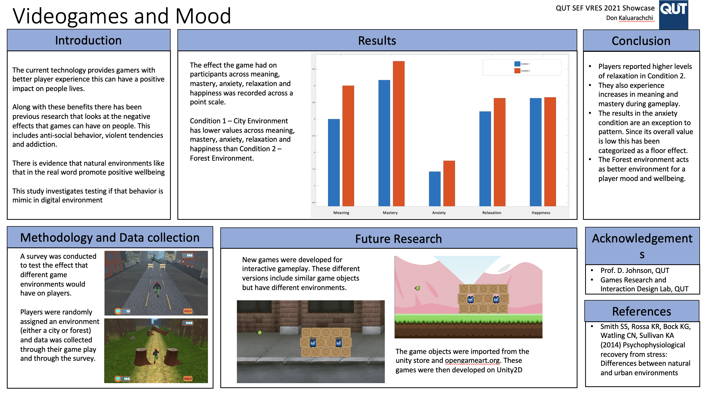

# VRES Games on Unity
 

- This repository contains the code for the first part of the research done under Dr Daniel Johnson on the topic "effects of video games on wellbeing and mood". This project used Unity2D and the programming language c# developed on the visual studio editor 
---
### Skills gained at the completion of the project
- Designing two different environments for the games to be given to the participants.
- Focused on data collection and other research methodolgies using the results from the game.
- Understanding of unity2D
---
### Installation/Use instructions
-   Load the project onto unity2D and run the game.
---
### Completed Project
- Given below is the outcome of the 2 sets of games that were fully developed over the course of the research duration.

---
### Notes about the Project
- More levels and extra features could be added to the project.
---
